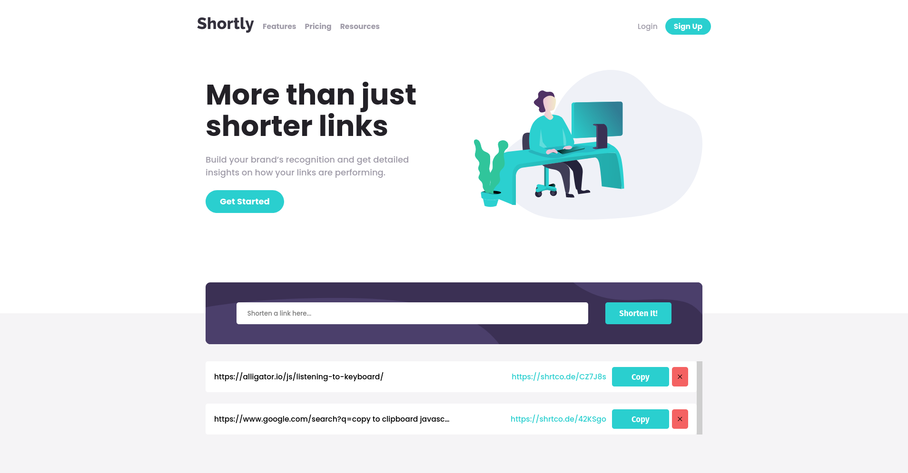
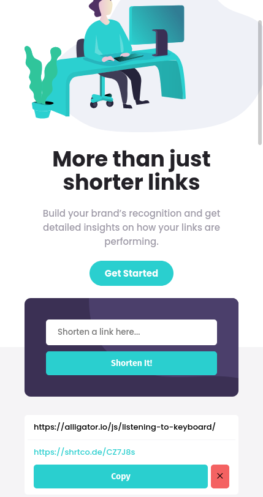
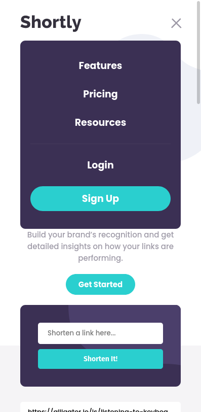

# Frontend Mentor - Shortly URL shortening API Challenge

This is a solution to the [Shorty app challenge on Frontend Mentor](https://www.frontendmentor.io/challenges/url-shortening-api-landing-page-2ce3ob-G). Frontend Mentor challenges help you improve your coding skills by building realistic projects.

## Table of contents

- [Overview](#overview)
  - [The challenge](#the-challenge)
  - [Screenshot](#screenshot)
  - [Links](#links)
- [My process](#my-process)
  - [Built with](#built-with)
  - [What I learned](#what-i-learned)
  - [Added Features](#added-features)
  - [Useful resources](#useful-resources)
- [Author](#author)

## Overview

### The challenge

Users should be able to:

- View the optimal layout for the app depending on their device's screen size.
- Shorten any valid URL.
- See a list of their shortened links, even after refreshing the browser.
- Copy the shortened link to their clipboard in a single click.
- Receive an error message when the form is submitted if the input field is empty.

### Screenshot

### Links

- Live Site URL: [Shorty App](https://shorty-app.netlify.app/)

### Built with

- Semantic HTML5 markup.
- CSS custom properties.
- CSS Flexbox.
- SASS.
- JavaScript.
- Parcel for development.

### What I learned

- JavaScript Promises.

### Added Features

- Display message if there's an error from the API
- Delete a link

### Useful resources

- [How To Build Sortable Drag & Drop With Vanilla Javascript](https://www.youtube.com/watch?v=jfYWwQrtzzY)
- [Unique id generator in javascript](https://learnersbucket.com/examples/javascript/unique-id-generator-in-javascript/)

## Author

- Frontend Mentor - [@faissalabsml](https://www.frontendmentor.io/profile/faissalabsml)
- Twitter - [@faissalabs](https://twitter.com/faissalabs)
